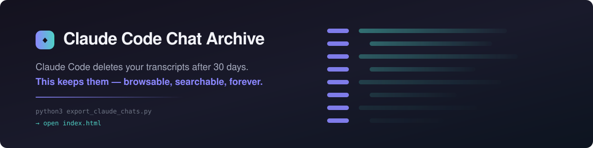
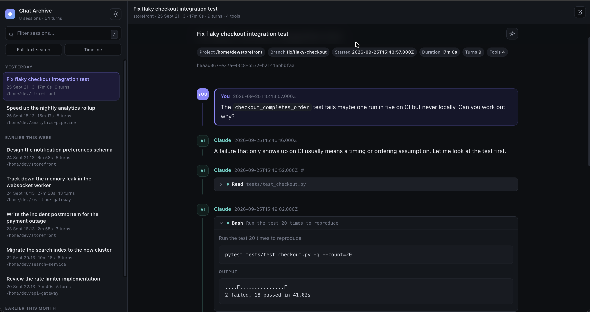
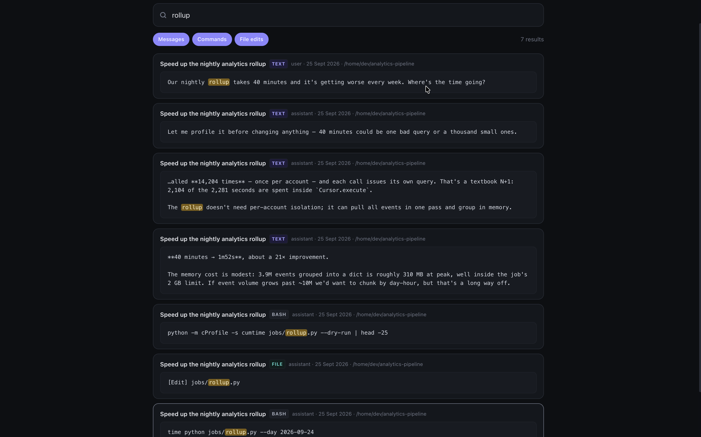

<div align="center">



<br>

**Claude Code deletes your session transcripts after 30 days.**<br>
**This archives them permanently — and makes them beautiful to read.**

<br>


</div>

---

## 😱 The problem

Claude Code writes every conversation to `~/.claude/projects/*.jsonl`, then **silently deletes anything older than `cleanupPeriodDays` — which defaults to 30.**

That research session where you finally cracked the architecture? The debugging marathon with the fix you'd never reconstruct? Gone, with no warning and no undo.

## ✨ The fix

```bash
git clone https://github.com/kxzongoing/claude-code-chat-archive.git
cd claude-code-chat-archive
python3 export_claude_chats.py
```

Then open **`index.html`**. That's the whole setup — Python 3.9+, zero dependencies, zero network calls.

Every later run picks up what's new and leaves the rest alone. **Once a conversation is archived, it stays — even after Claude Code deletes the original.**

## 👀 See it before you run it

Don't want to point it at your own chats yet? Build a demo archive from invented transcripts:

```bash
python3 tools/make_demo.py --open
```

That writes `docs/demo/` — eight fictional sessions rendered by the **same code** that renders a real archive. Nothing in it touches `~/.claude`. It's also the right way to grab screenshots or check a UI change without exposing your own work.

---

## 🖥️ What you get

<div align="center">


</div>

### 📚 A browser for everything

Open `index.html` for a two-pane reader: sessions grouped by **Today / Yesterday / Earlier this week**, live filtering, and full keyboard navigation — <kbd>/</kbd> to search, <kbd>↑</kbd><kbd>↓</kbd> or <kbd>j</kbd><kbd>k</kbd> to move, <kbd>Esc</kbd> to clear. Light and dark themes, remembered between visits.

### 💬 Conversations that read like conversations

Messages render as **actual prose** — headings, lists, tables, and syntax-styled code — not walls of preformatted text. Three lanes stay visually distinct so you always know who said what:

| Lane          | Appearance                                                               |
| ------------- | ------------------------------------------------------------------------ |
| 🧑 **You**    | Filled card with an accent border — the thing you scan for               |
| 🤖 **Claude** | Clean prose, unadorned                                                   |
| ⚙️ **Tools**  | Muted monospace folds, collapsed by default, each showing its own output |

Tool results are nested **inside the call that produced them** — so a 500-turn session scans in seconds, and nothing machine-generated is ever mislabelled as something you typed.

### 🔍 Search that actually finds things

`index/search.html` does instant client-side search across every turn, bash command and file edit — filter by type, jump straight to the moment in the conversation. No server, no index to build.

### 📦 Plain files underneath

Everything is JSON and Markdown you can grep, diff, or feed to other tools:

| Path                                         | Contents                                              |
| -------------------------------------------- | ----------------------------------------------------- |
| `sessions/<project>/<id>/`                   | `raw.json`, `conversation.md`, `conversation.html`    |
| `index/session_index.{json,md}`              | One row per session — title, project, duration, links |
| `extracts/tool_invocations.{json,md}`        | Every tool call, matched with its result              |
| `extracts/file_modifications.{json,md}`      | Every Edit / Write / MultiEdit / NotebookEdit         |
| `extracts/bash_commands.{json,md}`           | Every Bash call with stdout and stderr                |
| `extracts/architectural_decisions.{json,md}` | Heuristically surfaced decision points                |
| `timeline/timeline.{json,md}`                | All of the above, merged and sorted by date           |

Session UUIDs and original timestamps survive everywhere — filenames, table rows, HTML anchors.

> **Note** — `architectural_decisions` is a heuristic (plan proposals, `AskUserQuestion` points, decision language). Read it for signal, not as a curated list.

---

## 🛡️ Stop losing chats in the first place

Before anything else, widen Claude Code's retention window in `~/.claude/settings.json`:

```json
{
  "cleanupPeriodDays": 365
}
```

This tool can only archive what still exists when it runs. A year of retention buys you margin; running it on a schedule closes the gap completely:

**macOS / Linux** — `crontab -e`:

```cron
0 20 * * * cd /path/to/claude-code-chat-archive && /usr/bin/python3 export_claude_chats.py >/dev/null 2>&1
```

**Windows** — Task Scheduler → daily → `python3 export_claude_chats.py`, "Start in" set to the checkout.

---

## ♻️ Already lost chats? Maybe not.

If you archived sessions before and they've vanished from your index, **they are probably still on disk.** Earlier versions rebuilt the index only from live sources, so pruned sessions dropped out even though `sessions/` still held every byte.

Just run it again:

```bash
python3 export_claude_chats.py
```

The backfill pass replays every session in `manifest.json` from its archived `raw.json`:

```
Sessions found: 23 | rendered: 2 | unchanged (skipped): 21 | restored from archive: 28 | failed: 0
Total sessions in index: 51
```

As long as `manifest.json` and `sessions/` survive, nothing is lost.

---

## ⚙️ Options

```
--root <dir>         Source projects dir (default: ~/.claude/projects)
--output <dir>       Export dir (default: this checkout)
--project <substr>   Only process project dirs matching a substring
--force              Re-render every session, ignoring the manifest
```

## 🔒 How it stays safe

**Incremental** — `manifest.json` records a sha256 per source file. Unchanged sessions are skipped.

**Append-only** — aggregates rebuild from the union of live sources **and** every session in the manifest, replayed from its archived `raw.json`. Claude Code's prune can't remove anything from your index.

**Local** — reads `~/.claude/projects`, writes to disk. No network, no telemetry, no dependencies. Transcript text is escaped before rendering, and `javascript:` URLs are stripped.

---

## 🚨 Privacy — read this before pushing anywhere

**Your exported conversations are private. Never commit them.**

The archive holds whatever you discussed with Claude: proprietary source, file paths, customer data, credentials pasted into prompts. The bundled `.gitignore` excludes every directory the exporter writes, so a fork stays code-only.

If you point `--output` elsewhere, ignore that path too. Before your first push:

```bash
git status --porcelain     # should list source files only
```

To back up the archive itself, use a **private** repo or ordinary file backup — never a public one.

---

## 🤝 Contributing

Issues and PRs welcome. Please never paste real transcript content into a bug report — a redacted snippet or the structure alone is plenty.

## 📄 License

MIT — see [LICENSE](LICENSE).

<div align="center"><br><sub>Your conversations are work. Keep them.</sub></div>
